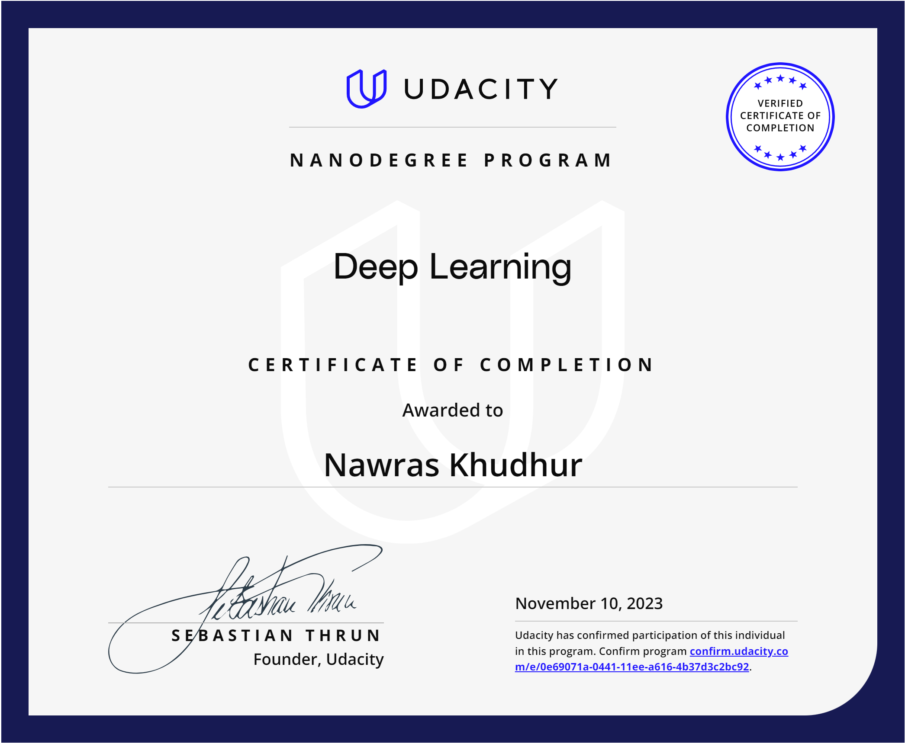

# Udacity Deep Learning Nanodegree Program
[Link to the official certificate](confirm.udacity.com/e/0e69071a-0441-11ee-a616-4b37d3c2bc92)

# About
This repository contains project work for Udacity's [Deep Learning Nanodegree Program](https://www.udacity.com/course/deep-learning-nanodegree--nd101).

# Projects
* Developing a Handwritten Digits Classifier with PyTorch.
* Landmark Classification & Tagging for Social Media.
* Text Translation and Sentiment Analysis using Transformers.
* Face Generation.
